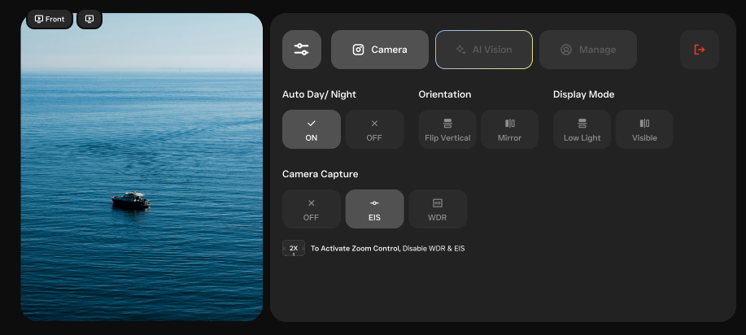

# CamConnect

[](https://developer.android.com/)
[](https://kotlinlang.org/)
[](https://developer.android.com/jetpack/compose)
[](https://material.io/)

> **Professional Android Camera Streaming Application with Intelligent Adaptive UI**

CamConnect transforms your Android device into a powerful camera streaming and control system. Whether you're monitoring a security camera, controlling a drone camera, or managing multiple camera feeds, CamConnect provides an intuitive interface that adapts to your needs and device capabilities.

## 🎯 What is CamConnect?

CamConnect is a sophisticated Android application designed for real-time camera streaming and control. It features an **adaptive layout system** that automatically adjusts based on your device type (phone/tablet) and your current task requirements.

### Key Capabilities:
- **Live Camera Streaming** with low-latency performance
- **Intelligent Layout Adaptation** that maximizes your viewing experience
- **Advanced Recording System** with professional-grade features
- **Comprehensive Device Control** for camera settings and configurations
- **Real-time Status Monitoring** of system health and connectivity

## 🎯 Core Features

### 📱 Adaptive Layout System
CamConnect automatically adapts its interface based on your device and usage patterns:

- **Minimal Control Mode** (90% camera view, 10% controls) - Perfect for passive monitoring
- **Expanded Control Mode** (60% camera view, 40% controls) - Balanced viewing and control
- **Full Control Mode** (45% camera view, 55% controls) - Maximum configuration options

The app intelligently switches between these modes based on your device type and current activity.

### 📹 Real-time Camera Control
Take full control of your camera system:

- **Live Streaming** with minimal delay for real-time monitoring
- **Zoom Controls** (1x, 2x, 4x) with smooth transitions and precise control
- **IR and Vision Modes** for enhanced visibility in different lighting conditions
- **Multi-camera Support** with seamless switching between different camera feeds

### 🎬 Professional Recording System
Capture high-quality recordings with advanced features:

- **Screen Recording** with customizable quality settings
- **Recording State Management** with visual feedback and progress indicators
- **Duration Tracking** with real-time display of recording length
- **Automatic Gallery Integration** for easy access to saved recordings

### 📊 Smart Status Monitoring
Stay informed about your system's health and performance:

- **Battery Monitoring** with color-coded indicators and percentage display
- **Network Status** showing WiFi/LTE connectivity in real-time
- **AI Function Status** displaying active AI features and performance metrics
- **System Health Indicators** for optimal performance monitoring

### 🔧 Advanced Device Management
Configure your camera system with precision:

- **Camera Settings** including resolution, frame rate, and quality controls
- **AI Detection Controls** for object detection, far object detection, and motion sensing
- **Display Settings** with auto day/night mode and vision mode selection
- **Image Quality Controls** including HDR, EIS (Electronic Image Stabilization), and orientation settings

## 🖼️ Visual Interface

### Layout Modes in Action

#### Minimal Control Layout (90/10 Split)


*When you need maximum viewing area - perfect for monitoring or surveillance tasks*

#### Expanded Control Layout (60/40 Split)


*Balanced interface for active camera control and monitoring*

#### Full Control Layout (45/55 Split)


*Complete control interface for advanced configuration and settings management*

<!-- ### Component Showcase

#### Smart Buttons

*Intelligent buttons that adapt to your device and current context*

#### Real-time Status

*Live status indicators showing battery, connectivity, and system health*

#### Recording Interface

*Professional recording controls with visual feedback and state management*

### Device Adaptation

#### Phone Experience

*Optimized for mobile devices with touch-friendly controls*

#### Tablet Experience

*Enhanced interface for larger screens with additional controls and information* -->

## 🏗️ Technical Architecture

### Built with Modern Android Technologies

- **Jetpack Compose** - Modern declarative UI framework for smooth, responsive interfaces
- **MVVM Architecture** - Clean separation of concerns with ViewModels for state management
- **StateFlow & Coroutines** - Reactive programming for real-time updates and async operations
- **Material Design 3** - Latest design system with dynamic theming and accessibility
- **Kotlin** - Modern programming language with null safety and coroutines

### Project Structure
```
CamConnect/
├── app/src/main/java/com/outdu/camconnect/
│   ├── ui/
│   │   ├── layouts/           # Adaptive layout containers
│   │   ├── components/        # Reusable UI components
│   │   ├── models/           # Data models and state
│   │   ├── theme/            # Material Design theming
│   │   └── viewmodels/       # ViewModels for state management
│   ├── communication/        # API communication layer
│   ├── network/             # Network utilities
│   ├── services/            # Background services
│   └── utils/               # Utility classes
├── docs/                    # Comprehensive documentation
└── README.md               # This file
```

## 🚀 Getting Started

### Prerequisites
- **Android Studio** Arctic Fox or later
- **Android SDK** 21+ (API 21)
- **Kotlin** 1.5+
- **Jetpack Compose** 1.0+

### Quick Installation

1. **Clone and Open**
   ```bash
   git clone https://github.com/Shathir/CamConnect.git
   cd CamConnect
   ```
   Open in Android Studio and let it sync

2. **Build and Run**
   - Build the project (Build → Make Project)
   - Run on your device or emulator
   - The app will automatically detect your device type and optimize the interface

### Basic Usage Example
```kotlin
@Composable
fun MainScreen() {
    CamConnectTheme {
        Surface(
            modifier = Modifier.fillMaxSize(),
            color = MaterialTheme.colorScheme.background
        ) {
            AdaptiveStreamLayout(context = LocalContext.current)
        }
    }
}
```

## 📚 Documentation

### 📖 [Complete Documentation](./docs/README.md)
Detailed guides covering all aspects of the application.

### 📋 Quick Reference
- **[UI Layouts](./docs/UI_LAYOUTS_DOCUMENTATION.md)** - How the adaptive layout system works
- **[Component Architecture](./docs/COMPONENT_ARCHITECTURE.md)** - Understanding the UI components
- **[State Management](./docs/STATE_MANAGEMENT_ARCHITECTURE.md)** - How data flows through the app
- **[Authentication](./docs/PIN_AUTHENTICATION_IMPLEMENTATION.md)** - Security and user management

## 🎨 Design Philosophy

### Material Design 3 Integration
CamConnect embraces Material Design 3 principles:
- **Dynamic Color Theming** that adapts to your device's wallpaper
- **Consistent Typography** and spacing for professional appearance
- **Accessible Color Contrast** for users with visual impairments
- **Responsive Component Sizing** that works on all screen sizes

### Adaptive Design
The app automatically:
- **Detects your device type** (phone/tablet) and optimizes accordingly
- **Adjusts layout proportions** based on screen size and orientation
- **Scales UI elements** for optimal touch interaction
- **Maintains readability** across different screen densities

## 🔧 How It Works

### Layout Adaptation
The app uses intelligent algorithms to:
1. **Detect Device Type** - Automatically identifies phone vs tablet
2. **Analyze Usage Patterns** - Learns your preferred layout modes
3. **Optimize Interface** - Adjusts controls and spacing accordingly
4. **Maintain Performance** - Ensures smooth operation on all devices

### State Management
CamConnect uses modern state management:
- **Reactive Updates** - UI automatically updates when data changes
- **Lifecycle Awareness** - Properly handles app lifecycle events
- **Memory Efficiency** - Optimized for minimal memory usage
- **Error Recovery** - Graceful handling of network and system errors

## 🧪 Testing & Quality

### Comprehensive Testing
- **Component Testing** - Individual UI components are thoroughly tested
- **State Testing** - State management logic is verified
- **Integration Testing** - End-to-end functionality is validated
- **Performance Testing** - App performance is monitored and optimized

### Code Quality
- **Kotlin Best Practices** - Following modern Kotlin conventions
- **Compose Optimization** - Efficient recomposition and state management
- **Memory Management** - Proper cleanup and resource management
- **Accessibility** - Full support for screen readers and assistive technologies

## 📱 Performance Features

### Optimization Strategies
- **Efficient Recomposition** - Smart UI updates that minimize unnecessary redraws
- **Memory Management** - Proper cleanup of resources and listeners
- **Lazy Loading** - Components load only when needed
- **State Caching** - Frequently accessed data is cached for speed

### Resource Management
- **DisposableEffect** - Automatic cleanup of system resources
- **Weak References** - Prevents memory leaks from long-running operations
- **Coroutine Lifecycle** - Proper cancellation of background tasks
- **Network Optimization** - Efficient handling of camera streams and data

## 🤝 Contributing

We welcome contributions from the community! 

### How to Contribute
1. **Fork the repository**
2. **Create a feature branch** (`git checkout -b feature/amazing-feature`)
3. **Make your changes** following our coding standards
4. **Test thoroughly** - ensure all tests pass
5. **Submit a Pull Request** with clear description of changes

### Development Standards
- **Code Style** - Follow Kotlin and Compose conventions
- **Testing** - Add tests for new features
- **Documentation** - Update docs for any changes
- **Performance** - Consider impact on app performance
- **Accessibility** - Ensure features work for all users

## 🐛 Troubleshooting

### Common Issues & Solutions

#### Memory Issues
- **Problem**: App becomes slow or crashes
- **Solution**: Ensure proper cleanup in `DisposableEffect` and cancel coroutines

#### State Synchronization
- **Problem**: UI doesn't update when data changes
- **Solution**: Use `StateFlow` for reactive state and proper error handling

#### Performance Issues
- **Problem**: App feels sluggish
- **Solution**: Optimize recomposition with `remember` and use lazy loading

### Debug Tools
- **Layout Inspector** - Visual debugging of UI components
- **Memory Profiler** - Monitor memory usage and identify leaks
- **Compose Debug Tools** - Inspect recomposition and state changes

## 📈 Future Roadmap

### Planned Features
- **Enhanced Animations** - More sophisticated transitions and micro-interactions
- **Advanced Camera Controls** - Additional camera features and modes
- **Cloud Integration** - Cloud storage and sharing capabilities
- **AI Enhancement** - Advanced AI features and object detection
- **Accessibility Improvements** - Enhanced support for assistive technologies

### Technical Improvements
- **Performance Optimization** - Further improvements in speed and efficiency
- **Testing Infrastructure** - Enhanced automated testing capabilities
- **Documentation** - Interactive documentation and examples
- **Component Library** - Comprehensive reusable component library

## 📄 License

This project is licensed under the [Apache License 2.0](https://www.apache.org/licenses/LICENSE-2.0) - see the [LICENSE](LICENSE) file for details.

## 🙏 Acknowledgments

- **Jetpack Compose Team** - For the amazing modern UI framework
- **Material Design Team** - For the comprehensive design system
- **Android Community** - For continuous feedback and support
- **Open Source Contributors** - For the libraries and tools that make this possible

## 📞 Support & Resources

### Documentation
- **[Complete Documentation](./docs/README.md)** - Full application guide
- **[API Reference](./docs/API_REFERENCE.md)** - Technical API documentation
- **[Troubleshooting Guide](./docs/TROUBLESHOOTING.md)** - Common issues and solutions

### Community
- **GitHub Issues** - Report bugs and request features
- **GitHub Discussions** - Ask questions and share ideas
- **Contributing Guidelines** - How to contribute to the project

### External Resources
- [Jetpack Compose Documentation](https://developer.android.com/jetpack/compose)
- [Material Design 3](https://m3.material.io/)
- [Android Architecture Components](https://developer.android.com/topic/architecture)
- [Kotlin Coroutines](https://kotlinlang.org/docs/coroutines-overview.html)


---

**Version**: 1.0  
**Last Updated**: 15-07-2025  
**Author**: Shathir  
**Status**: Complete  
**License**: Apache 2.0 

---

<div align="center">

**Made with ❤️ by the CamConnect Team**

[](https://github.com/Shathir/CamConnect/stargazers)
[](https://github.com/Shathir/CamConnect/network)
[](https://github.com/Shathir/CamConnect/issues)
[](https://github.com/Shathir/CamConnect/pulls)

</div>

