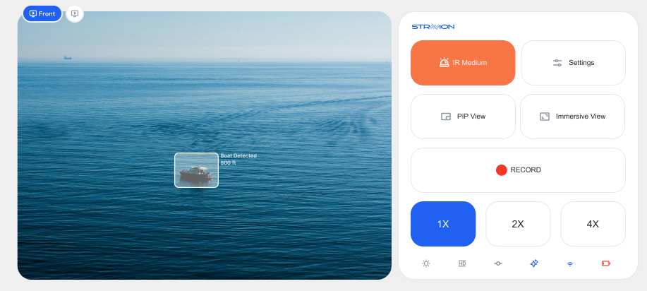

# Expanded Control Layout Documentation



## Overview
The Expanded Control Layout (`ExpandedControlLayout.kt`) provides a comprehensive control interface with full access to camera controls, recording functionality, and system status indicators. This layout is the most feature-rich interface, typically displayed when users need detailed control over the camera system.

## Layout Structure

### Header Section
- **Scout Logo & Text**: Displays the application branding
  - Logo adapts to system theme (white in dark theme, gray in light theme)
  - Text size adjusts based on device type (20sp for tablet, 16sp for phone)

### Control Button Rows

#### Settings Button
- **ID**: `Settings`
- **Function**: Opens the full settings/configuration panel
- **Visual Styling**:
  - **Dark Theme**:
    - Background: Medium dark background (`AppColors.ButtonBgColor` - #333333)
    - Icon Color: Medium gray (`AppColors.ButtonIconColor` - #808080)
    - Border: Immersive button border (`AppColors.immersiveButtonBorderColor` - #E2E8F0)
  - **Light Theme**:
    - Background: White (`AppColors.ButtonBgColor`)
    - Icon Color: Medium gray (`AppColors.ButtonIconColor` - #AEAEAE)
    - Border: Light gray border (#E2E8F0)
- **Click Action**: Triggers `onSettingsClick()` callback
- **Weight**: 1x width (standard button ratio)
- **Size**: 56dp (phone) / 112dp (tablet) when regular
- **Always Enabled**: Yes
- **API Used**: No direct API - UI navigation only

#### Picture-in-Picture Button
- **ID**: `picture-in-picture`
- **Function**: Reserved for picture-in-picture camera view functionality
- **Current Status**: **Disabled** - Not currently implemented
- **Visual Styling**:
  - **All Themes** (Disabled State):
    - Background: Immersive button border color (`AppColors.immersiveButtonBorderColor` - #E2E8F0)
    - Icon Color: Light gray (#C5CBD4)
    - Border: Immersive button border (#E2E8F0)
    - Enabled: False
- **Icon**: Picture-in-picture icon (`R.drawable.picture_in_picture_line`)
- **Click Action**: Currently empty placeholder (`{}`)
- **Weight**: 1x width (standard button ratio)
- **Size**: 56dp (phone) / 112dp (tablet) when regular
- **Layout Presence**: Available in expanded control layout button configurations
- **Future Implementation**: 
  - Intended to provide split-screen or overlay camera view
  - May enable secondary camera feed or resizable camera window
  - Could integrate with Android's native Picture-in-Picture mode for camera feeds
  - Potential for multi-camera view management
- **API Used**: No current API - reserved for future implementation

#### IR (Infrared) Button
- **ID**: `ir`
- **Function**: Should cycle through four IR intensity levels for night vision
- **Current Implementation Issue**: Currently only toggles between off (0) and high (15), but needs to be enhanced
- **Required Enhancement**: Implement 4-level cycling with the following states:

##### Required Color States and Logic:
1. **Off** (brightness = 0):
   - Background: White (`Color.White`)
   - Icon: Medium gray (`AppColors.ButtonIconColor` - #808080)
   - Border: Immersive button border (#E2E8F0)
   
2. **Low** (brightness = 5):
   - Background: Light orange (`#FFA07D`)
   - Icon: White (`Color.White`)
   - Border: Light orange (`#FFA07D`)
   
3. **Medium** (brightness = 10):
   - Background: Medium orange (`#F87646`)
   - Icon: White (`Color.White`)
   - Border: Medium orange (`#F87646`)
   
4. **High** (brightness = 15):
   - Background: Dark orange (`#F55114`)
   - Icon: White (`Color.White`)
   - Border: Dark orange (`#F55114`)

##### Required Cycling Logic:
- **Click Sequence**: Off → Low → Medium → High → Off (repeats)
- **Current State**: `currentState.irBrightness` determines current level
- **State Mapping**:
  - `irBrightness = 0` → Off
  - `irBrightness = 5` → Low  
  - `irBrightness = 10` → Medium
  - `irBrightness = 15` → High

##### Current Implementation (Needs Change):
- **Current Logic**: Simple toggle between 0 (off) and 15 (on)
- **Current Colors**: Only uses standard button colors and Record Red
- **Location**: `CameraControlViewModel.toggleIR()` method
- **Issue**: Does not support the 4-level cycling requirement

##### Disabled State (Vision Mode active):
- Background: Immersive button border color (`AppColors.immersiveButtonBorderColor` - #E2E8F0)
- Icon: Light gray (#C5CBD4)
- Border: Standard
- Enabled: False

- **Click Action**: `cameraControlViewModel.toggleIR()` (needs enhancement)
- **Enabled When**: `currentVisionMode != VisionMode.VISION`
- **Layout**: Row layout on tablets, Column on phones
- **API Used**:
  - **Primary API**: `MotocamAPIAndroidHelper.setIrBrightnessAsync()`
  - **Underlying Protocol**: `MotocamAPIHelper.setImgIRBrightnessCmd(value)`
  - **Command Structure**:
    ```
    Request Packet:
    | Header | Command | SubCommand | Data Length | Data | CRC |
    | SET(1) | IMAGE(4) | IRBRIGHTNESS(4) | 1 | 0/5/10/15 | 1 byte |
    ```
    - Header: `Header.SET` (1)
    - Command: `Commands.IMAGE` (4)
    - SubCommand: `ImageSubCommands.IRBRIGHTNESS` (4)
    - Values: 0 (off), 5 (low), 10 (medium), 15 (high)
  - **Success Response**:
    ```
    Response Packet:
    | Header | Command | SubCommand | Data Length | Success Flag | Data | CRC |
    | ACK(3) | IMAGE(4) | IRBRIGHTNESS(4) | 2 | Success(0) | Success(0) | 1 byte |
    ```
  - **Error Response**:
    ```
    Response Packet:
    | Header | Command | SubCommand | Data Length | Failed Flag | Error Code | CRC |
    | ACK(3) | IMAGE(4) | IRBRIGHTNESS(4) | 2 | Failed(1) | -1 to -6 | 1 byte |
    ```
  - **HTTP Communication**: HTTP POST to `http://192.168.2.1:80/api/motocam_api`
  - **Content-Type**: `application/octet-stream`
  - **Brightness Range**: 0-15 (discrete levels: 0, 5, 10, 15)

#### Collapse Screen Button
- **ID**: `collapse-screen`
- **Function**: Collapses the interface to minimal control layout
- **Visual Styling**:
  - **Dark Theme**:
    - Background: Medium dark background (`AppColors.ButtonBgColor` - #333333)
    - Icon Color: Medium gray (`AppColors.ButtonIconColor` - #808080)
    - Border: Immersive button border (#E2E8F0)
  - **Light Theme**:
    - Background: White
    - Icon Color: Medium gray (#AEAEAE)
    - Border: Light gray (#E2E8F0)
- **Click Action**: Triggers `onCollapseClick()` callback
- **Always Enabled**: Yes
- **API Used**: No direct API - UI state management only

### Recording Control Section

#### Record Button
- **Function**: Starts/stops screen recording with automatic layout switching
- **Visual States**:
  - **Not Recording**:
    - Background: Medium dark background (`AppColors.MediumDarkBackground` - #333333)
    - Dot: Red variant color (`AppColors.RecordRed` - #F43823)
    - Text: "RECORD" (medium light gray color - `AppColors.MediumLightGray`)
  - **Recording**:
    - Background: Record red (`AppColors.RecordRed` - #F43823)
    - Dot: White with pulsing animation (scale 1.0 to 1.2)
    - Text: "RECORDING [duration]" (white color - #FFFFFF)
  - **Stopping Recording**:
    - Background: Record red (70% opacity - `RecordRed.copy(alpha = 0.7f)`)
    - Dot: White (70% opacity)
    - Text: "STOPPING RECORDING..." (white color)
  - **Saved to Gallery**:
    - Background: Green (#4CAF50)
    - Dot: Green (#4CAF50)
    - Text: "SAVED TO GALLERY" (white color)

- **Click Behavior**:
  - **When Not Recording**: First collapses to minimal layout, then starts recording
  - **When Recording**: Stops recording directly
- **Height**: 112dp on tablets, 56dp on phones
- **Animation**: Smooth fade transitions between states (300ms)
- **API Used**:
  - **Primary Service**: `ScreenRecorderService` (Android Foreground Service)
  - **Android APIs**:
    - `MediaProjectionManager.createScreenCaptureIntent()` - Screen capture permission
    - `MediaProjection.getMediaProjection()` - Screen projection instance
    - `MediaRecorder` - Video recording engine
    - `VirtualDisplay.createVirtualDisplay()` - Screen mirroring
    - `MediaStore` - Gallery integration for saving
  - **Permission Requirements**:
    - `RECORD_AUDIO` - Audio recording (optional)
    - `WRITE_EXTERNAL_STORAGE` - File storage
    - `FOREGROUND_SERVICE` - Background recording
    - `POST_NOTIFICATIONS` - Recording notifications (Android 13+)
  - **Recording Configuration**:
    - Format: MPEG-4 (H.264 video encoding)
    - Frame Rate: 30 FPS
    - Bit Rate: 8192 kbps (8 Mbps)
    - Resolution: Device native resolution

### Zoom Control Section

#### Zoom Selector
- **Function**: Provides 1x, 2x, and 4x zoom level selection
- **Visual States**:
  - **Enabled**: Full opacity background (`AppColors.DarkBackground2`), interactive zoom buttons
  - **Disabled**: 50% opacity background (`DarkBackground2.copy(alpha = 0.5f)`) with message
- **Disabled When**: EIS (Electronic Image Stabilization) or HDR is enabled
- **Disabled Message**: "Zoom disabled when EIS or HDR is enabled"
- **Click Action**: `cameraControlViewModel.setZoom(newZoom)`
- **Height**: 112dp on tablets, 56dp on phones
- **Background**: Dark background (`AppColors.DarkBackground2` - #222222)
- **Zoom Button States**:
  - **Selected**:
    - **Dark Theme**: Background: Dark gray selected (`AppColors.ButtonSelectedBgColor` - #515151), Text: White (`AppColors.ButtonSelectedIconColor`)
    - **Light Theme**: Background: Light gray selected (#D7D7D7), Text: Dark gray (#3F3F3F)
  - **Unselected**:
    - **Dark Theme**: Background: Medium dark (`AppColors.ButtonBgColor` - #333333), Text: Medium gray (`AppColors.ButtonIconColor` - #808080)
    - **Light Theme**: Background: White, Text: Medium gray (#AEAEAE)
- **API Used**:
  - **Primary API**: `MotocamAPIAndroidHelper.setZoomAsync()`
  - **Underlying Protocol**: `MotocamAPIHelper.setImgZoomCmd(zoom.displayVal)`
  - **Command Structure**:
    ```
    Request Packet:
    | Header | Command | SubCommand | Data Length | Data | CRC |
    | SET(1) | IMAGE(4) | ZOOM(1) | 1 | 1/2/4 | 1 byte |
    ```
    - Header: `Header.SET` (1)
    - Command: `Commands.IMAGE` (4)
    - SubCommand: `ImageSubCommands.ZOOM` (1)
    - Values: 
      - `ZOOM.X1` (1) for 1x zoom
      - `ZOOM.X2` (2) for 2x zoom
      - `ZOOM.X4` (4) for 4x zoom
  - **Success Response**:
    ```
    Response Packet:
    | Header | Command | SubCommand | Data Length | Success Flag | Data | CRC |
    | ACK(3) | IMAGE(4) | ZOOM(1) | 2 | Success(0) | Success(0) | 1 byte |
    ```
  - **Error Response**:
    ```
    Response Packet:
    | Header | Command | SubCommand | Data Length | Failed Flag | Error Code | CRC |
    | ACK(3) | IMAGE(4) | ZOOM(1) | 2 | Failed(1) | -1 to -6 | 1 byte |
    ```
  - **HTTP Communication**: HTTP POST to `http://192.168.2.1:80/api/motocam_api`
  - **Zoom Levels**: Discrete levels only (no continuous zoom)

### Toggle Icons Row

#### Stabilize Icon
- **ID**: `stabilize`
- **Function**: Electronic Image Stabilization toggle
- **State Source**: `cameraControlState.isEisEnabled`
- **Visual States**:
  - **Active**: Selected color (white in dark theme, defined in icon config)
  - **Inactive**: Gray (#777777)
- **Side Effect**: Disables zoom when enabled
- **API Used**:
  - **Primary API**: `MotocamAPIAndroidHelper.setEisAsync()`
  - **Underlying Protocol**: `MotocamAPIHelper.setEisCmd(value)`
  - **Command Structure**:
    ```
    Request Packet:
    | Header | Command | SubCommand | Data Length | Data | CRC |
    | SET(1) | IMAGE(4) | EIS(11) | 1 | 0/1 | 1 byte |
    ```

#### HDR Icon
- **ID**: `hdr`
- **Function**: High Dynamic Range toggle
- **State Source**: `cameraControlState.isHdrEnabled`
- **Visual States**:
  - **Active**: Selected color (white in dark theme, defined in icon config)
  - **Inactive**: Gray (#777777)
- **Side Effect**: Disables zoom when enabled
- **API Used**:
  - **Primary API**: `MotocamAPIAndroidHelper.setWdrAsync()`
  - **Underlying Protocol**: `MotocamAPIHelper.setWdrCmd(value)`
  - **Command Structure**:
    ```
    Request Packet:
    | Header | Command | SubCommand | Data Length | Data | CRC |
    | SET(1) | IMAGE(4) | WDR(10) | 1 | 0/1 | 1 byte |
    ```

#### View Mode Icon
- **ID**: `viewmode`
- **Function**: Auto day/night mode toggle
- **State Source**: `cameraControlState.isAutoDayNightEnabled`
- **Visual States**:
  - **Active**: Selected color (white in dark theme, defined in icon config)
  - **Inactive**: Gray (#777777)
- **API Used**:
  - **Primary API**: `MotocamAPIAndroidHelper.setDayModeAsync()`
  - **Underlying Protocol**: `MotocamAPIHelper.setImgDayModeCmd(mode.displayVal)`
  - **Command Structure**:
    ```
    Request Packet:
    | Header | Command | SubCommand | Data Length | Data | CRC |
    | SET(1) | IMAGE(4) | DAYMODE(5) | 1 | 0/1 | 1 byte |
    ```

### Status Indicators Row

#### WiFi Indicator
- **Function**: Shows current WiFi connection status
- **States**:
  - **Connected**: Active WiFi icon
  - **Disconnected**: Inactive/grayed WiFi icon
- **Data Source**: `systemStatus.isWifiConnected`

#### AI Status Indicator
- **Function**: Shows AI processing status
- **States**:
  - **Enabled**: Active AI icon
  - **Disabled**: Inactive/grayed AI icon
- **Data Source**: `systemStatus.isAiEnabled`
- **Padding**: Vertical 4dp

#### Battery Indicator
- **Function**: Shows current battery level
- **Display**: Battery icon with level indication
- **Data Source**: `systemStatus.batteryLevel`
- **Percentage Display**: Hidden (`showPercentage = false`)
- **API Used**:
  - **Android API**: `BatteryManager` system service
  - **Update Source**: System battery broadcasts

## Communication Architecture

### HTTP Communication Layer
- **Primary Protocol**: HTTP REST API over WiFi
- **Default IP**: `192.168.2.1` (camera device)
- **Main API Port**: `80` (HTTP)
- **Health Check Port**: `8080` (ping endpoint)
- **API Endpoint**: `http://192.168.2.1:80/api/motocam_api`
- **Client Library**: Ktor HTTP client with CIO engine
- **Connection Management**: Automatic device discovery via ARP table
- **Wrapper Layer**: `MotocamAPIHelperWrapper` provides coroutine-based async operations
- **Error Handling**: Comprehensive exception handling with logging

### Command Structure
All camera commands follow this structure:
```
[Header][Command][SubCommand][DataLength][Data][CRC]
```
- **Transport**: HTTP POST with hex-encoded command data
- **Content-Type**: `application/octet-stream`
- **Authentication**: Session cookie authentication
- **Header**: SET(1), GET(2), ACK(3), RESPONSE(4)
- **Command**: STREAMING(1), NETWORK(2), CONFIG(3), IMAGE(4), AUDIO(5), SYSTEM(6)
- **SubCommand**: Specific operation within command category
- **Data**: Command-specific parameters
- **CRC**: Checksum for error detection

### Error Codes
| Error Code | Description |
|------------|-------------|
| -1 | Error in executing the command |
| -2 | Invalid packet header |
| -3 | Invalid command |
| -4 | Invalid sub-command |
| -5 | Invalid Data/Data Length |
| -6 | CRC does not match |

### Health Monitoring
- **API**: `MotocamAPIAndroidHelper.getHealthStatusAsync()`
- **HTTP Endpoint**: `http://192.168.2.1:8080/ping`
- **Monitors**:
  - CPU Usage
  - Memory Usage
  - ISP Temperature
  - IR Temperature
  - Sensor Temperature
  - Service Status (RTSPS, Streamer, etc.)

## Device-Specific Adaptations

### Tablet Layout
- Larger padding (32dp horizontal, 22dp vertical)
- Increased spacing between elements (22dp)
- Row-based layout for main content
- Larger text sizes (20sp for header)
- Different button groupings:
  - Row 1: Settings only
  - Row 2: IR, IR Intensity
  - Row 3: Collapse Screen

### Phone Layout
- Smaller padding (12dp horizontal, 14dp vertical)
- Reduced spacing (14dp)
- Column-based layout with scrolling
- Smaller text sizes (16sp for header)
- Different button groupings:
  - Row 1: IR, IR Intensity, Settings
  - Row 2: Collapse Screen

## Memory Management
- Implements `DisposableEffect` for cleanup
- Calls `MemoryManager.cleanupWeakReferences()` on disposal
- Proper logging for debugging memory issues

## State Management
- Uses `RecordingViewModel` for recording state
- Uses `CameraControlViewModel` for camera controls
- Uses `CameraLayoutViewModel` for layout state
- All states collected with `collectAsStateWithLifecycle()`

## Animation Features
- Pulsing record dot during recording
- Smooth state transitions for record button text
- Fade animations for state changes (300ms duration)
- Scale animation for record indicator (1.0 to 1.2 scale)

---
*This documentation covers the comprehensive Expanded Control Layout with full API integration details and visual component references.* 