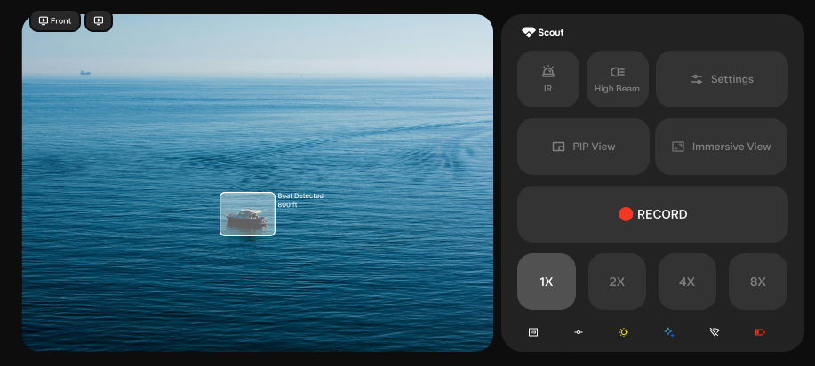

# Expanded Control Layout Documentation



## Overview
The Expanded Control Layout (`ExpandedControlLayout.kt`) provides a comprehensive control interface with full access to camera controls, recording functionality, and system status indicators. This layout is the most feature-rich interface, typically displayed when users need detailed control over the camera system.

## Layout Structure

### Header Section
- **Scout Logo & Text**: Displays the application branding
  - Logo adapts to system theme (white in dark theme, gray in light theme)
  - Text size adjusts based on device type (20sp for tablet, 16sp for phone)

### Control Button Rows

#### Settings Button
- **ID**: `Settings`
- **Function**: Opens the full settings/configuration panel
- **Visual States**:
  - Default: Standard button background with icon color
  - Active: Highlighted background with selected icon color
- **Click Action**: Triggers `onSettingsClick()` callback
- **Weight**: 2x width compared to other buttons
- **Always Enabled**: Yes
- **API Used**: No direct API - UI navigation only

#### IR (Infrared) Button
- **ID**: `ir`
- **Function**: Toggles infrared illumination for night vision
- **Visual States**:
  - **Disabled State** (Vision Mode active):
    - Background: Dark gray (#272727)
    - Icon: Darker gray (#363636)
    - Border: Standard
  - **Enabled State**:
    - Background: Record red when active, standard when inactive
    - Icon: White (dark theme) or standard color when active
    - Border: Red when active, standard when inactive
- **Click Action**: `cameraControlViewModel.toggleIR()`
- **Enabled When**: `currentVisionMode != VisionMode.VISION`
- **Layout**: Row layout on tablets, Column on phones
- **API Used**:
  - **Primary API**: `MotocamAPIAndroidHelper.setIrBrightnessAsync()`
  - **Underlying Protocol**: `MotocamAPIHelper.setImgIRBrightnessCmd(value)`
  - **Command Structure**:
    - Header: `Header.SET` (1)
    - Command: `Commands.IMAGE` (4)
    - SubCommand: `ImageSubCommands.IRBRIGHTNESS`
    - Value: 0 (off) or 15 (low intensity default)
  - **HTTP Communication**: HTTP POST to `http://192.168.2.1:80/api/motocam_api`
  - **Brightness Range**: 0-255 (0=off, 15=low, 5=high)

#### IR Intensity/Cut Filter Button
- **ID**: `ir-cut-filter`
- **Function**: Toggles between high and low intensity IR illumination
- **Visual States**:
  - **Disabled State** (IR not enabled):
    - Background: Dark gray (#272727)
    - Icon: Darker gray (#363636)
  - **High Intensity** (when IR enabled and not low intensity):
    - Background: Selected background color
    - Icon: Selected icon color
  - **Low Intensity** (when IR enabled and low intensity):
    - Background: Standard background
    - Icon: Standard icon color
- **Click Action**: `cameraControlViewModel.toggleIrIntensity()`
- **Enabled When**: `cameraControlState.isIrEnabled` is true
- **Text**: "IR Intensity"
- **Weight**: 2x width on phones, 1x on tablets
- **API Used**:
  - **Primary API**: `MotocamAPIAndroidHelper.setIrBrightnessAsync()`
  - **Underlying Protocol**: `MotocamAPIHelper.setImgIRBrightnessCmd(value)`
  - **Command Structure**: Same as IR button
  - **Value Logic**: Toggle between 15 (low intensity) and 5 (high intensity)
  - **HTTP Communication**: HTTP POST to `http://192.168.2.1:80/api/motocam_api`

#### Collapse Screen Button
- **ID**: `collapse-screen`
- **Function**: Collapses the interface to minimal control layout
- **Visual States**:
  - Standard button styling with hover/active states
- **Click Action**: Triggers `onCollapseClick()` callback
- **Always Enabled**: Yes
- **API Used**: No direct API - UI state management only

### Recording Control Section

#### Record Button
- **Function**: Starts/stops screen recording with automatic layout switching
- **Visual States**:
  - **Not Recording**:
    - Background: Medium dark background
    - Dot: Red variant color
    - Text: "RECORD" (gray color)
  - **Recording**:
    - Background: Record red
    - Dot: White with pulsing animation (scale 1.0 to 1.2)
    - Text: "RECORDING [duration]" (white color)
  - **Stopping Recording**:
    - Background: Record red (70% opacity)
    - Dot: White (70% opacity)
    - Text: "STOPPING RECORDING..." (white color)
  - **Saved to Gallery**:
    - Background: Green (#4CAF50)
    - Dot: Green (#4CAF50)
    - Text: "SAVED TO GALLERY" (white color)

- **Click Behavior**:
  - **When Not Recording**: First collapses to minimal layout, then starts recording
  - **When Recording**: Stops recording directly
- **Height**: 112dp on tablets, 56dp on phones
- **Animation**: Smooth fade transitions between states (300ms)
- **API Used**:
  - **Primary Service**: `ScreenRecorderService` (Android Foreground Service)
  - **Android APIs**:
    - `MediaProjectionManager.createScreenCaptureIntent()` - Screen capture permission
    - `MediaProjection.getMediaProjection()` - Screen projection instance
    - `MediaRecorder` - Video recording engine
    - `VirtualDisplay.createVirtualDisplay()` - Screen mirroring
    - `MediaStore` - Gallery integration for saving
  - **Permission Requirements**:
    - `RECORD_AUDIO` - Audio recording (optional)
    - `WRITE_EXTERNAL_STORAGE` - File storage
    - `FOREGROUND_SERVICE` - Background recording
    - `POST_NOTIFICATIONS` - Recording notifications (Android 13+)
  - **Recording Configuration**:
    - Format: MPEG-4 (H.264 video encoding)
    - Frame Rate: 30 FPS
    - Bit Rate: 8192 kbps (8 Mbps)
    - Resolution: Device native resolution

### Zoom Control Section

#### Zoom Selector
- **Function**: Provides 1x, 2x, and 4x zoom level selection
- **Visual States**:
  - **Enabled**: Full opacity background, interactive zoom buttons
  - **Disabled**: 50% opacity background with message
- **Disabled When**: EIS (Electronic Image Stabilization) or HDR is enabled
- **Disabled Message**: "Zoom disabled when EIS or HDR is enabled"
- **Click Action**: `cameraControlViewModel.setZoom(newZoom)`
- **Height**: 112dp on tablets, 56dp on phones
- **Background**: Dark background (#DarkBackground2)
- **API Used**:
  - **Primary API**: `MotocamAPIAndroidHelper.setZoomAsync()`
  - **Underlying Protocol**: `MotocamAPIHelper.setImgZoomCmd(zoom.displayVal)`
  - **Command Structure**:
    - Header: `Header.SET` (1)
    - Command: `Commands.IMAGE` (4)
    - SubCommand: `ImageSubCommands.ZOOM`
    - Values: 
      - `ZOOM.X1` for 1x zoom
      - `ZOOM.X2` for 2x zoom
      - `ZOOM.X4` for 4x zoom
  - **HTTP Communication**: HTTP POST to `http://192.168.2.1:80/api/motocam_api`
  - **Zoom Levels**: Discrete levels only (no continuous zoom)

### Toggle Icons Row

#### Stabilize Icon
- **ID**: `stabilize`
- **Function**: Electronic Image Stabilization toggle
- **State Source**: `cameraControlState.isEisEnabled`
- **Visual States**:
  - Active: Selected color (defined in icon config)
  - Inactive: Gray (#777777)
- **Side Effect**: Disables zoom when enabled

#### HDR Icon
- **ID**: `hdr`
- **Function**: High Dynamic Range toggle
- **State Source**: `cameraControlState.isHdrEnabled`
- **Visual States**:
  - Active: Selected color (defined in icon config)
  - Inactive: Gray (#777777)
- **Side Effect**: Disables zoom when enabled

#### View Mode Icon
- **ID**: `viewmode`
- **Function**: Auto day/night mode toggle
- **State Source**: `cameraControlState.isAutoDayNightEnabled`
- **Visual States**:
  - Active: Selected color (defined in icon config)
  - Inactive: Gray (#777777)

### Status Indicators Row

#### WiFi Indicator
- **Function**: Shows current WiFi connection status
- **States**:
  - Connected: Active WiFi icon
  - Disconnected: Inactive/grayed WiFi icon
- **Data Source**: `systemStatus.isWifiConnected`

#### AI Status Indicator
- **Function**: Shows AI processing status
- **States**:
  - Enabled: Active AI icon
  - Disabled: Inactive/grayed AI icon
- **Data Source**: `systemStatus.isAiEnabled`
- **Padding**: Vertical 4dp

#### Battery Indicator
- **Function**: Shows current battery level
- **Display**: Battery icon with level indication
- **Data Source**: `systemStatus.batteryLevel`
- **Percentage Display**: Hidden (`showPercentage = false`)
- **API Used**:
  - **Android API**: `BatteryManager` system service
  - **Update Source**: System battery broadcasts

## Communication Architecture

### HTTP Communication Layer
- **Primary Protocol**: HTTP REST API over WiFi
- **Default IP**: `192.168.2.1` (camera device)
- **Main API Port**: `80` (HTTP)
- **Health Check Port**: `8080` (ping endpoint)
- **API Endpoint**: `http://192.168.2.1:80/api/motocam_api`
- **Client Library**: Ktor HTTP client with CIO engine
- **Connection Management**: Automatic device discovery via ARP table
- **Wrapper Layer**: `MotocamAPIHelperWrapper` provides coroutine-based async operations
- **Error Handling**: Comprehensive exception handling with logging

### Command Structure
All camera commands follow this structure:
```
[Header][Command][SubCommand][DataLength][Data][CRC]
```
- **Transport**: HTTP POST with hex-encoded command data
- **Content-Type**: `application/octet-stream`
- **Authentication**: Session cookie authentication
- **Header**: SET(1), GET(2), ACK(3), RESPONSE(4)
- **Command**: STREAMING(1), NETWORK(2), CONFIG(3), IMAGE(4), AUDIO(5), SYSTEM(6)
- **SubCommand**: Specific operation within command category
- **Data**: Command-specific parameters
- **CRC**: Checksum for error detection

### Health Monitoring
- **API**: `MotocamAPIAndroidHelper.getHealthStatusAsync()`
- **HTTP Endpoint**: `http://192.168.2.1:8080/ping`
- **Monitors**:
  - CPU Usage
  - Memory Usage
  - ISP Temperature
  - IR Temperature
  - Sensor Temperature
  - Service Status (RTSPS, Streamer, etc.)

## Device-Specific Adaptations

### Tablet Layout
- Larger padding (32dp horizontal, 22dp vertical)
- Increased spacing between elements (22dp)
- Row-based layout for main content
- Larger text sizes (20sp for header)
- Different button groupings:
  - Row 1: Settings only
  - Row 2: IR, IR Intensity
  - Row 3: Collapse Screen

### Phone Layout
- Smaller padding (12dp horizontal, 14dp vertical)
- Reduced spacing (14dp)
- Column-based layout with scrolling
- Smaller text sizes (16sp for header)
- Different button groupings:
  - Row 1: IR, IR Intensity, Settings
  - Row 2: Collapse Screen

## Memory Management
- Implements `DisposableEffect` for cleanup
- Calls `MemoryManager.cleanupWeakReferences()` on disposal
- Proper logging for debugging memory issues

## State Management
- Uses `RecordingViewModel` for recording state
- Uses `CameraControlViewModel` for camera controls
- Uses `CameraLayoutViewModel` for layout state
- All states collected with `collectAsStateWithLifecycle()`

## Animation Features
- Pulsing record dot during recording
- Smooth state transitions for record button text
- Fade animations for state changes (300ms duration)
- Scale animation for record indicator (1.0 to 1.2 scale)

---
*This documentation covers the comprehensive Expanded Control Layout with full API integration details and visual component references.* 