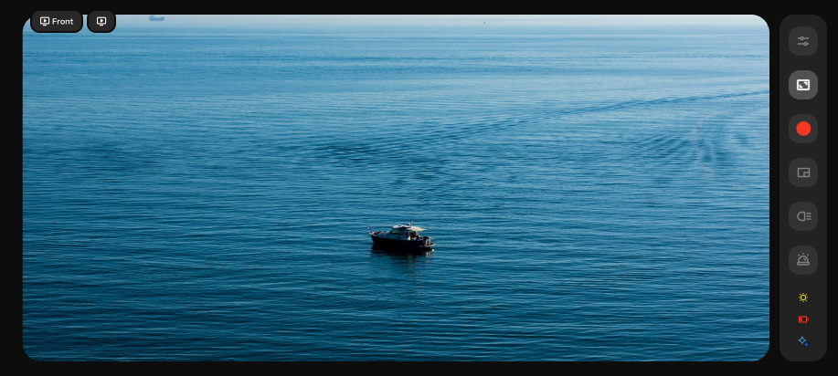

# Minimal Control Layout Documentation



## Overview
The Minimal Control Layout (`MinimalControlLayout.kt`) provides a streamlined, space-efficient interface designed for immersive camera operation. This layout displays essential controls in a vertical arrangement, maximizing screen real estate for the camera feed while maintaining access to critical functionality.

## Layout Structure

### Vertical Control Column
All controls are arranged in a single vertical column with `SpaceAround` distribution, ensuring optimal use of screen space while maintaining easy access to essential functions.

## Control Elements

### Settings Button
- **ID**: `settings`
- **Function**: Opens the full settings/configuration panel
- **Visual Styling**:
  - **Dark Theme**:
    - Background: White (`Color.White`)
    - Icon Color: Medium Gray (`AppColors.MediumGray`)
    - Border: Immersive button border (`AppColors.immersiveButtonBorderColor` - #E2E8F0)
  - **Light Theme**:
    - Background: White (`Color.White`) 
    - Icon Color: Medium Gray (#757575)
    - Border: Light gray border (#E2E8F0)
- **Click Action**: Triggers `onSettingsClick()` callback
- **Compact Mode**: Yes (icon only, no text)
- **Size**: 48dp (phone) / 76dp (tablet) when compact
- **Always Enabled**: Yes
- **API Used**: No direct API - UI navigation only

### Expand Control Button
- **ID**: `camera_switch`
- **Function**: Expands the interface to the full expanded control layout
- **Visual Styling**:
  - **All Themes**:
    - Background: Stravion Blue (`AppColors.StravionBlue` - #2061F2)
    - Icon Color: White (`Color.White`)
    - Border: Stravion Blue (#2061F2)
- **Click Action**: Triggers `onExpandClick()` callback
- **Compact Mode**: Yes (icon only, no text)
- **Size**: 48dp (phone) / 76dp (tablet) when compact
- **Always Enabled**: Yes
- **API Used**: No direct API - UI state management only

### Picture-in-Picture Button
- **ID**: `picture-in-picture`
- **Function**: Reserved for picture-in-picture camera view functionality
- **Current Status**: **Disabled** - Not currently implemented
- **Visual Styling**:
  - **All Themes** (Disabled State):
    - Background: Immersive button border color (`AppColors.immersiveButtonBorderColor` - #E2E8F0)
    - Icon Color: Light gray (#C5CBD4)
    - Border: Immersive button border (#E2E8F0)
    - Enabled: False
- **Icon**: Picture-in-picture icon (`R.drawable.picture_in_picture_line`)
- **Click Action**: Currently mapped to `onExpandClick` (placeholder)
- **Compact Mode**: Yes (icon only, no text)
- **Size**: 48dp (phone) / 76dp (tablet) when compact
- **Future Implementation**: 
  - Intended to provide split-screen or overlay camera view
  - May enable secondary camera feed or resizable camera window
  - Could integrate with Android's native Picture-in-Picture mode
- **API Used**: No current API - reserved for future implementation

### Screen Recording Button
- **ID**: `screen-record`
- **Function**: Starts/stops screen recording functionality
- **Visual States**:
  - **Not Recording**:
    - Icon: Record icon (`R.drawable.record_icon`)
    - Icon Color: Record red (`AppColors.RecordRed` - #F43823)
    - Background: White (`Color.White`)
    - Border: Immersive button border (#E2E8F0)
    - Text: "Start Recording"
  - **Recording**:
    - Icon: Record rectangle (`R.drawable.record_rectangle`)
    - Icon Color: White (`Color.White`)
    - Background: Record red (#F43823)
    - Border: Record red (#F43823)
    - Text: "Stop Recording"
- **Click Action**: `recordingViewModel.toggleRecording(context)`
- **Compact Mode**: Yes (icon only, no text)
- **Size**: 48dp (phone) / 76dp (tablet) when compact
- **Permissions Required**:
  - Media Projection permission for screen capture
  - Notification permission (Android 13+)
- **API Used**:
  - **Primary Service**: `ScreenRecorderService` (Android Foreground Service)
  - **Android APIs**:
    - `MediaProjectionManager.createScreenCaptureIntent()` - Screen capture permission
    - `MediaProjectionManager.getMediaProjection()` - Screen projection instance
    - `MediaRecorder` - Video recording engine with H.264 encoding
    - `VirtualDisplay.createVirtualDisplay()` - Screen mirroring surface
    - `MediaStore.Video.Media` - Gallery integration for saving videos
    - `NotificationManager` - Recording status notifications
  - **Permission APIs**:
    - `POST_NOTIFICATIONS` permission check (Android 13+)
    - `ActivityResultContracts.RequestPermission()` - Permission launcher
    - `ActivityResultContracts.StartActivityForResult()` - Media projection launcher
  - **Service Configuration**:
    - Foreground service with persistent notification
    - Format: MPEG-4 container
    - Video: H.264 encoding, 30 FPS, 8192 kbps bit rate
    - Resolution: Native device resolution with scaling
    - Audio: Optional (currently disabled)

### IR (Infrared) Button
- **ID**: `ir`
- **Function**: Should cycle through four IR intensity levels for night vision
- **Current Implementation Issue**: Currently only toggles between off (0) and high (15), but needs to be enhanced
- **Required Enhancement**: Implement 4-level cycling with the following states:

#### Required Color States and Logic:
1. **Off** (brightness = 0):
   - Background: White (`Color.White`)
   - Icon: Medium gray (`AppColors.ButtonIconColor` - #808080)
   - Border: Immersive button border (#E2E8F0)
   
2. **Low** (brightness = 5):
   - Background: Light orange (`#FFA07D`)
   - Icon: White (`Color.White`)
   - Border: Light orange (`#FFA07D`)
   
3. **Medium** (brightness = 10):
   - Background: Medium orange (`#F87646`)
   - Icon: White (`Color.White`)
   - Border: Medium orange (`#F87646`)
   
4. **High** (brightness = 15):
   - Background: Dark orange (`#F55114`)
   - Icon: White (`Color.White`)
   - Border: Dark orange (`#F55114`)

#### Required Cycling Logic:
- **Click Sequence**: Off → Low → Medium → High → Off (repeats)
- **Current State**: `currentState.irBrightness` determines current level
- **State Mapping**:
  - `irBrightness = 0` → Off
  - `irBrightness = 5` → Low  
  - `irBrightness = 10` → Medium
  - `irBrightness = 15` → High

#### Current Implementation (Needs Change):
- **Current Logic**: Simple toggle between 0 (off) and 15 (on)
- **Current Colors**: Only uses White (off) and Record Red (on)
- **Location**: `CameraControlViewModel.toggleIR()` method
- **Issue**: Does not support the 4-level cycling requirement

#### Disabled State (Vision Mode active):
- Background: Immersive button border color (#E2E8F0)
- Icon: Light gray (#C5CBD4)
- Border: Standard
- Enabled: False

- **Click Action**: `cameraControlViewModel.toggleIR()` (needs enhancement)
- **Enabled When**: `currentVisionMode != VisionMode.VISION`
- **Compact Mode**: Yes (icon only, no text)
- **Size**: 48dp (phone) / 76dp (tablet) when compact
- **API Used**:
  - **Primary API**: `MotocamAPIAndroidHelper.setIrBrightnessAsync()`
  - **Underlying Protocol**: `MotocamAPIHelper.setImgIRBrightnessCmd(value)`
  - **Command Structure**:
    ```
    Request Packet:
    | Header | Command | SubCommand | Data Length | Data | CRC |
    | SET(1) | IMAGE(4) | IRBRIGHTNESS(4) | 1 | 0/5/10/15 | 1 byte |
    ```
    - Header: `Header.SET` (1)
    - Command: `Commands.IMAGE` (4)
    - SubCommand: `ImageSubCommands.IRBRIGHTNESS` (4)
    - Values: 0 (off), 5 (low), 10 (medium), 15 (high)
  - **Success Response**:
    ```
    Response Packet:
    | Header | Command | SubCommand | Data Length | Success Flag | Data | CRC |
    | ACK(3) | IMAGE(4) | IRBRIGHTNESS(4) | 2 | Success(0) | Success(0) | 1 byte |
    ```
  - **Error Response**:
    ```
    Response Packet:
    | Header | Command | SubCommand | Data Length | Failed Flag | Error Code | CRC |
    | ACK(3) | IMAGE(4) | IRBRIGHTNESS(4) | 2 | Failed(1) | -1 to -6 | 1 byte |
    ```
  - **HTTP Communication**: HTTP POST to `http://192.168.2.1:80/api/motocam_api`
  - **Content-Type**: `application/octet-stream`
  - **Brightness Range**: 0-15 (discrete levels: 0, 5, 10, 15)

## Status Indicators

### WiFi Indicator
- **Function**: Shows current WiFi connection status
- **States**:
  - **Connected**: Active WiFi icon with full opacity
  - **Disconnected**: Inactive/grayed WiFi icon
- **Data Source**: `systemStatus.isWifiConnected`
- **Position**: Below control buttons in vertical arrangement

### AI Status Indicator
- **Function**: Shows AI processing status
- **States**:
  - **Enabled**: Active AI icon
  - **Disabled**: Inactive/grayed AI icon
- **Data Source**: `systemStatus.isAiEnabled`
- **Position**: Below WiFi indicator

### Battery Indicator
- **Function**: Shows current battery level with visual representation
- **Display**: Battery icon with level indication
- **Data Source**: `systemStatus.batteryLevel`
- **Position**: Bottom of the control column
- **API Used**:
  - **Android API**: `BatteryManager` system service
  - **Intent Filter**: `Intent.ACTION_BATTERY_CHANGED` broadcasts
  - **Battery Properties**:
    - `BATTERY_PROPERTY_CAPACITY` - Current battery percentage
    - `BATTERY_PROPERTY_STATUS` - Charging/discharging status
  - **Update Source**: System battery level broadcasts

## Permission Management

### Screen Recording Permissions
The layout handles complex permission flows for screen recording:

#### Android 13+ (API 33+)
- **Notification Permission**: Required for foreground service
- **Permission Flow**:
  1. Check notification permission
  2. Request if not granted
  3. Launch screen capture intent
  4. Start foreground service
- **API Used**:
  - `ContextCompat.checkSelfPermission(context, Manifest.permission.POST_NOTIFICATIONS)`
  - `ActivityResultContracts.RequestPermission()` launcher

#### Pre-Android 13
- **Media Projection**: Automatically available
- **Permission Flow**:
  1. Launch screen capture intent directly
  2. Start foreground service
- **API Used**:
  - Direct media projection without notification permission

### Permission Launchers
- **Screen Record Launcher**: Handles media projection result
  - Type: `ActivityResultContracts.StartActivityForResult()`
  - Intent: `MediaProjectionManager.createScreenCaptureIntent()`
  - Result: `RecordConfig` with result code and intent data
- **Permission Launcher**: Handles notification permission result
  - Type: `ActivityResultContracts.RequestPermission()`
  - Permission: `Manifest.permission.POST_NOTIFICATIONS`
  - Flow: Continues to media projection if granted
- **Service Integration**: Starts `ScreenRecorderService` with proper configuration
  - Action: `ScreenRecorderService.ACTION_START`
  - Extra: `ScreenRecorderService.RECORD_CONFIG` with projection data

## Communication Architecture

### Camera Control APIs
- **Protocol**: HTTP REST API over WiFi
- **Primary IP**: `192.168.2.1` (default camera device IP)
- **Main API Port**: `80` (HTTP)
- **Health Check Port**: `8080` (ping endpoint)
- **API Endpoint**: `http://192.168.2.1:80/api/motocam_api`
- **Client Library**: Ktor HTTP client with CIO engine
- **Discovery**: Automatic device discovery via ARP table scanning
- **Connection**: `MotocamSocketClient` handles HTTP communication
- **Wrapper**: `MotocamAPIHelperWrapper` provides async coroutine interface

### Command Protocol Structure
```
[Header][Command][SubCommand][DataLength][Data][CRC]
```
- **Transport**: HTTP POST with hex-encoded command data
- **Content-Type**: `application/octet-stream`
- **Authentication**: Session cookie authentication
- **Header Values**: SET(1), GET(2), ACK(3), RESPONSE(4)
- **Command Categories**: STREAMING(1), NETWORK(2), CONFIG(3), IMAGE(4), AUDIO(5), SYSTEM(6)
- **Error Handling**: CRC checksum validation and exception handling
- **Timeout**: Connection timeout of 10 seconds for HTTP requests

### Error Codes
| Error Code | Description |
|------------|-------------|
| -1 | Error in executing the command |
| -2 | Invalid packet header |
| -3 | Invalid command |
| -4 | Invalid sub-command |
| -5 | Invalid Data/Data Length |
| -6 | CRC does not match |

### Android System Integration
- **Media Projection**: System-level screen capture API
- **MediaRecorder**: Hardware-accelerated video encoding
- **Foreground Service**: Background recording with user notification
- **File System**: Temporary cache files with MediaStore integration
- **Notifications**: Persistent recording status with system integration

## Layout Characteristics

### Spacing and Arrangement
- **Main Container**: Column with `Arrangement.SpaceAround`
- **Padding**: 8dp on all sides
- **Vertical Alignment**: Center-aligned horizontally
- **Button Spacing**: Automatic distribution for optimal touch targets

### Device Adaptations
- **Universal Layout**: Same layout for both tablets and phones
- **Compact Design**: Prioritizes screen real estate for camera feed
- **Touch-Optimized**: All buttons sized for easy finger access
- **Button Sizes**:
  - **Phone**: 48dp (compact) / 56dp (regular)
  - **Tablet**: 76dp (compact) / 112dp (regular)

### Visual Styling
- **Compact Buttons**: All buttons use `isCompact = true`
- **Icon-Only Display**: `showText = false` for all controls
- **Consistent Theming**: Follows app's adaptive dark/light theme design
- **Corner Radius**: 14dp (phone) / 20dp (tablet)
- **Status Integration**: System indicators seamlessly integrated

## State Management

### ViewModels Used
- **RecordingViewModel**: Manages recording state and operations
  - State: `RecordingState` (NotRecording, Recording, StoppingRecording, SavedToGallery)
  - Duration tracking with coroutine-based timer
  - Service lifecycle management
- **CameraControlViewModel**: Handles camera control states (IR, intensity)
  - State: `CameraControlState` with IR settings
  - API communication for IR control
  - Vision mode dependency management
- **CameraLayoutViewModel**: Manages layout and vision mode states
  - Vision mode restrictions for IR controls
  - Layout state transitions

### State Collection
- **Recording State**: `isRecording.collectAsStateWithLifecycle()`
- **Camera Control State**: `cameraControlState.collectAsStateWithLifecycle()`
- **Theme State**: `isSystemInDarkTheme()`

## Memory Management
- **Cleanup Implementation**: `DisposableEffect` for proper cleanup
- **Memory References**: `MemoryManager.cleanupWeakReferences()` on disposal
- **Error Handling**: Catches and logs cleanup errors
- **Lifecycle Awareness**: Proper logging for component lifecycle

## Service Integration

### Screen Recorder Service
- **Service Class**: `ScreenRecorderService`
- **Type**: Foreground service with persistent notification
- **Actions**: 
  - `ACTION_START`: Begins screen recording
  - `ACTION_STOP`: Ends screen recording
- **Configuration**: `RecordConfig` with result code and intent data
- **Lifecycle**: 
  - Automatic start/stop based on media projection callbacks
  - Resource cleanup on service destruction
  - Gallery integration for saved videos

### Intent Handling
- **Media Projection Manager**: System service for screen capture permissions
- **Activity Result Handling**: Proper handling of permission results
- **Service Starting**: Uses `ContextCompat.startForegroundService()` for compatibility
- **Error Recovery**: Graceful handling of permission denials and errors

## User Experience Features

### Minimal Distraction
- **Clean Interface**: Only essential controls visible
- **Quick Access**: Single-tap access to most common functions
- **Status Awareness**: Critical system status always visible
- **Expansion Option**: Easy upgrade to full controls when needed

### Accessibility
- **Content Descriptions**: All buttons have proper content descriptions
- **Touch Targets**: Appropriately sized for accessibility guidelines
- **Visual Feedback**: Clear visual states for all interactive elements
- **System Integration**: Respects system accessibility settings

---
*This documentation covers the streamlined Minimal Control Layout optimized for immersive camera operation with essential controls and comprehensive API integration.*