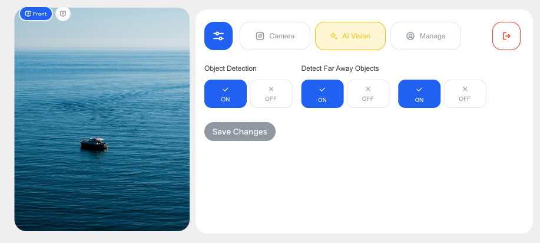

# Settings Layout Documentation


## Overview
The Settings Layout (`FullControlLayout.kt`) provides comprehensive configuration and control capabilities through a tabbed interface. This layout is designed for in-depth device and camera configuration, offering full access to all system settings and advanced features.

## Layout Structure

### Main Container
- **Background**: Transparent background allowing camera feed visibility
- **Padding**: Device-specific spacing (24dp for tablets, 12dp for phones)
- **Arrangement**: Vertical spacing between sections
- **Scrolling**: Managed scroll state with proper cleanup

## Header Section

### Navigation Controls

#### Settings Screen Button
- **ID**: `settings-screen`
- **Function**: Returns to the camera control interface
- **Visual Styling**:
  - **Dark Theme**:
    - Background: Dark gray selected (`AppColors.ButtonSelectedBgColor` - #515151)
    - Icon Color: White (`AppColors.ButtonSelectedIconColor`)
    - Border: Button border color (`AppColors.ButtonBorderColor`)
  - **Light Theme**:
    - Background: Light gray selected (`AppColors.ButtonSelectedBgColor` - #D7D7D7)
    - Icon Color: Dark gray (`AppColors.ButtonSelectedIconColor` - #3F3F3F)
    - Border: Light gray border
- **Click Action**: Triggers `onCollapseClick()` callback
- **Compact Mode**: Yes (icon only, no text)
- **Size**: 48dp (phone) / 76dp (tablet) when compact
- **Always Enabled**: Yes
- **API Used**: No direct API - UI navigation only

#### Tab Switcher
- **Function**: Central navigation between different settings categories
- **Weight**: Takes remaining space in header row (`weight(1f)`)
- **Integration**: Uses `ControlTabSwitcher` component
- **State Management**: Controlled by `selectedTab` and `onTabSelected`
- **Visual Styling**:
  - **Tab Background**:
    - **Dark Theme**: Dark background (`AppColors.DarkBackground2` - #222222)
    - **Light Theme**: Light background
  - **Selected Tab**:
    - **Dark Theme**: Stravion Blue (`AppColors.StravionBlue` - #2061F2) with white text
    - **Light Theme**: Stravion Blue with white text
  - **Unselected Tab**:
    - **Dark Theme**: Medium gray text (`AppColors.MediumGray` - #808080)
    - **Light Theme**: Medium gray text
- **API Used**: No direct API - UI state management only

#### Logout Button
- **ID**: `logout`
- **Function**: User logout functionality
- **Visual Styling**:
  - **Dark Theme**:
    - Background: Medium dark background (`AppColors.ButtonBgColor` - #333333)
    - Icon Color: Red (`Color.Red`)
    - Border: Red (`Color.Red`)
  - **Light Theme**:
    - Background: White
    - Icon Color: Red
    - Border: Red
- **Enabled**: True (feature implemented)
- **Compact Mode**: Yes (icon only, no text)
- **Size**: 48dp (phone) / 76dp (tablet) when compact
- **API Used**: Triggers logout flow with memory cleanup

## Tab Navigation System

### Control Tab Switcher
The layout implements a sophisticated tab system for organizing different categories of settings:

#### Available Tabs
1. **Camera Control Tab** (`ControlTab.CAMERA_CONTROL`)
2. **AI Control Tab** (`ControlTab.AI_CONTROL`)
3. **License Control Tab** (`ControlTab.LICENSE_CONTROL`)

### Tab Content Areas

#### Camera Control Tab (`ControlTab.CAMERA_CONTROL`)


- **Content**: Advanced camera configuration settings
- **Component**: `CameraLayout()`
- **Features**: 
  - Camera parameter adjustments
  - Image quality settings
  - Vision mode controls (Visible, Infrared, Both)
  - Camera mode settings (Normal, EIS, HDR)
  - Orientation controls (Normal, Flip, Mirror, Both)
- **State Management**: Integrated with `CameraLayoutViewModel`
- **API Used**:
  - **Configuration APIs**: `MotocamAPIAndroidHelper` suite of camera control functions
  - **Primary APIs**:
    - `setMiscAsync()` - Combined settings control for HDR/EIS and Vision Mode
      ```
      Request: | SET(1) | IMAGE(4) | MISC(13) | 1 | calculated_value | CRC |
      Response: | ACK(3) | IMAGE(4) | MISC(13) | 2 | Success(0) | Data | CRC |
      ```
      **MISC Value Calculation Logic**:
      ```kotlin
      // Base WDR/EIS value
      val wdreisval = when {
          !hdr && !eis -> 1    // No HDR, No EIS
          !hdr && eis -> 2     // No HDR, Yes EIS  
          hdr && !eis -> 3     // Yes HDR, No EIS
          else -> 1            // Default if both set
      }
      
      // Final MISC value based on vision mode
      val miscValue = when {
          visible && !infrared -> wdreisval           // Only visible (1-3)
          visible && infrared -> 4 + wdreisval        // Both visible and infrared (5-7)
          !visible && infrared -> 8 + wdreisval       // Only infrared (9-11)
          else -> 1                                   // Default to visible mode
      }
      ```
      **Usage Conditions**:
      - Called when camera mode changes (EIS/HDR selection)
      - Called when vision mode changes (Visible/Infrared/Both)
      - Always used in combination with stream restart
      - Mutually exclusive HDR and EIS enforcement
    - `setMirrorAsync()` - Image mirroring controls
      ```
      Request: | SET(1) | IMAGE(4) | MIRROR(7) | 1 | 0/1 | CRC |
      Response: | ACK(3) | IMAGE(4) | MIRROR(7) | 2 | Success(0) | Data | CRC |
      ```
      **Usage Conditions**:
      - Called when orientation mode includes Mirror (Mirror, Both)
      - Can be applied without stream restart if only orientation changes
    - `setFlipAsync()` - Image flip controls
      ```
      Request: | SET(1) | IMAGE(4) | FLIP(8) | 1 | 0/1 | CRC |
      Response: | ACK(3) | IMAGE(4) | FLIP(8) | 2 | Success(0) | Data | CRC |
      ```
      **Usage Conditions**:
      - Called when orientation mode includes Flip (Flip, Both)
      - Can be applied without stream restart if only orientation changes
    - `setWdrAsync()` - Wide Dynamic Range settings (Legacy)
      ```
      Request: | SET(1) | IMAGE(4) | WDR(10) | 1 | 0/1 | CRC |
      Response: | ACK(3) | IMAGE(4) | WDR(10) | 2 | Success(0) | Data | CRC |
      ```
      **Note**: This API is available but WDR/HDR is now controlled via MISC value
    - `setEisAsync()` - Electronic Image Stabilization (Legacy)
      ```
      Request: | SET(1) | IMAGE(4) | EIS(11) | 1 | 0/1 | CRC |
      Response: | ACK(3) | IMAGE(4) | EIS(11) | 2 | Success(0) | Data | CRC |
      ```
      **Note**: This API is available but EIS is now controlled via MISC value
    - `setDayModeAsync()` - Auto day/night mode control
      ```
      Request: | SET(1) | IMAGE(4) | DAYMODE(5) | 1 | 0/1 | CRC |
      Response: | ACK(3) | IMAGE(4) | DAYMODE(5) | 2 | Success(0) | Data | CRC |
      ```
      **Usage Conditions**:
      - Called when Auto Low Light toggle is changed
      - Controls automatic day/night switching
  - **Command Protocol**: Uses standard MotocamAPI command structure
  - **HTTP Communication**: HTTP POST to `http://192.168.2.1:80/api/motocam_api`
  - **Content-Type**: `application/octet-stream`
  - **Configuration Management**:
    - `getConfigAsync("Current")` - Current device configuration
      ```
      Request: | GET(2) | CONFIG(3) | CURRENT(12) | 0 | - | CRC |
      Response: | RESPONSE(4) | CONFIG(3) | CURRENT(12) | 12 | Success(0) | Config Data | CRC |
      ```
    - `getConfigAsync("Default")` - Default configuration values
      ```
      Request: | GET(2) | CONFIG(3) | DEFAULT(8) | 0 | - | CRC |
      Response: | RESPONSE(4) | CONFIG(3) | DEFAULT(8) | 12 | Success(0) | Config Data | CRC |
      ```
    - `getConfigAsync("Factory")` - Factory reset values
      ```
      Request: | GET(2) | CONFIG(3) | FACTORY(4) | 0 | - | CRC |
      Response: | RESPONSE(4) | CONFIG(3) | FACTORY(4) | 12 | Success(0) | Config Data | CRC |
      ```
  - **Stream Restart Logic**:
    - Stream restart required when: MISC value changes, DAYMODE changes
    - Stream restart NOT required when: Only orientation (flip/mirror) changes
    - Optimization: Detects orientation-only changes to avoid unnecessary stream interruption

#### AI Control Tab (`ControlTab.AI_CONTROL`)



- **Content**: AI processing and system configuration
- **Component**: `AiLayout(systemStatus, onSystemStatusChange)`
- **Features**:
  - AI processing toggles
  - System performance settings
  - Device control options
- **State Management**: 
  - Receives current `systemStatus`
  - Updates through `onSystemStatusChange` callback
- **API Used**:
  - **System Status API**: `MotocamAPIAndroidHelper.getHealthStatusAsync()`
    ```
    Request: | GET(2) | SYSTEM(6) | HEALTH_CHECK(6) | 0 | - | CRC |
    Response: | RESPONSE(4) | SYSTEM(6) | HEALTH_CHECK(6) | 1-32 | Success(0) | Health Data | CRC |
    ```
  - **Health Monitoring Data Structure**:
    ```
    | streamer | rtsps | portablertc | cpu_usage | memory_usage | isp_temp | ir_temp | sensor_temp |
    | 0/1      | 0/1   | 0/1         | 0-100     | 0-100        | 0-100    | 0-100   | 0-100       |
    ```
  - **Health Monitoring**:
    - CPU usage monitoring (0-100%)
    - Memory usage tracking (0-100%)
    - Temperature monitoring (ISP, IR, Sensor) (0-100°C)
    - Service status (RTSPS, Streamer, Portable RTC) (0=inactive, 1=active)
  - **AI Processing Control**: Device-specific AI pipeline management
  - **Performance Monitoring**: Real-time system performance metrics
  - **Update Frequency**: Configurable polling interval for health status

#### License Control Tab (`ControlTab.LICENSE_CONTROL`)


- **Content**: Device information and licensing
- **Component**: `LicenseLayout()`
- **Features**:
  - Device information display
  - License management
  - System information
  - Version details
- **API Used**:
  - **Device Information APIs**:
    - Android system properties (`Build.MODEL`, `Build.VERSION`, etc.)
    - Device hardware information
    - Network interface details
  - **Configuration APIs**:
    - `getCurrentConfig()` - Device configuration details
    - System version and build information
  - **System Information APIs**:
    - **Camera Name**: 
      ```
      Request: | GET(2) | SYSTEM(6) | CAMERA_NAME(1) | 0 | - | CRC |
      Response: | RESPONSE(4) | SYSTEM(6) | CAMERA_NAME(1) | 1-32 | Success(0) | Name | CRC |
      ```
    - **Firmware Version**:
      ```
      Request: | GET(2) | SYSTEM(6) | FIRMWARE(2) | 0 | - | CRC |
      Response: | RESPONSE(4) | SYSTEM(6) | FIRMWARE(2) | 1-32 | Success(0) | Version | CRC |
      ```
    - **MAC Address**:
      ```
      Request: | GET(2) | SYSTEM(6) | MAC_ADDRESS(3) | 0 | - | CRC |
      Response: | RESPONSE(4) | SYSTEM(6) | MAC_ADDRESS(3) | 1-32 | Success(0) | MAC | CRC |
      ```
  - **License Validation**: Device-specific licensing information
  - **Serial Number**: Hardware identification

## Helper Components

### Custom Toggle Button
```kotlin
CustomToggleButton(
    label: String,
    isSelected: Boolean,
    onClick: () -> Unit,
    modifier: Modifier = Modifier
)
```

#### Functionality
- **Purpose**: Binary toggle controls throughout settings
- **Visual States**:
  - **Selected**: 
    - **Dark Theme**: Blue variant background (`AppColors.BlueVariant` - #1A73E8)
    - **Light Theme**: Blue variant background
  - **Unselected**: 
    - **Dark Theme**: Dark gray background (`AppColors.DarkGray` - #515151)
    - **Light Theme**: Light gray background
- **Styling**: Rounded corners (8dp), centered text
- **Typography**: Body medium style with white text
- **API Integration**: Can trigger camera API calls based on implementation

### Custom Selectable Button
```kotlin
CustomSelectableButton(
    label: String,
    isSelected: Boolean,
    selectedColor: Color = Color.Red,
    modifier: Modifier = Modifier,
    onClick: () -> Unit
)
```

#### Functionality
- **Purpose**: Single-selection from multiple options
- **Visual States**:
  - **Selected**: Custom color background (default red `Color.Red`)
  - **Unselected**: 
    - **Dark Theme**: Dark gray background (`AppColors.DarkGray` - #515151)
    - **Light Theme**: Light gray background
- **Customization**: Configurable selected color
- **Styling**: Rounded corners (8dp), centered text
- **API Integration**: Commonly used for camera setting options (resolution, quality, etc.)

### Setting Row
```kotlin
SettingRow(
    label: String, 
    content: @Composable RowScope.() -> Unit
)
```

#### Functionality
- **Purpose**: Consistent layout for settings items
- **Structure**:
  - Label: White text, 14sp
  - Content: Flexible content area
- **Spacing**: 4dp between label and content, 8dp vertical padding
- **Usage**: Container for camera API controls and system settings

## Communication Architecture

### Camera Configuration APIs
- **Primary Interface**: `MotocamAPIAndroidHelper` object with async methods
- **Protocol**: HTTP REST API over WiFi
- **IP Address**: `192.168.2.1` (default camera device)
- **Main API Port**: `80` (HTTP)
- **Health Check Port**: `8080` (ping endpoint)
- **API Endpoint**: `http://192.168.2.1:80/api/motocam_api`
- **Client Library**: Ktor HTTP client with CIO engine
- **Connection Management**: Automatic device discovery and connection handling

### Configuration Management
- **Factory Config**: Default manufacturer settings
  - API: `getConfigAsync("Factory")`
  - Command: `MotocamAPIHelper.getFactoryConfigCmd()`
- **Default Config**: User-defined default settings
  - API: `getConfigAsync("Default")`
  - Command: `MotocamAPIHelper.getDefaultConfigCmd()`
- **Current Config**: Active device configuration
  - API: `getConfigAsync("Current")`
  - Command: `MotocamAPIHelper.getCurrentConfigCmd()`

### System Monitoring APIs
- **Health Status**: Comprehensive device health information
  - API: `getHealthStatusAsync()`
  - Returns: `HealthStatus` data class with system metrics
  - Monitoring: Real-time CPU, memory, temperature tracking
- **Network Status**: WiFi and connectivity monitoring
  - API: `getWifiStateCmd()`
    ```
    Request: | GET(2) | NETWORK(2) | WIFI_STATE(3) | 0 | - | CRC |
    Response: | RESPONSE(4) | NETWORK(2) | WIFI_STATE(3) | 2 | Success(0) | 1/2 | CRC |
    ```
  - Returns: Current network configuration and status (1=Hotspot, 2=Client)

### Error Handling and Logging
- **Exception Management**: Comprehensive try-catch blocks with logging
- **API Timeout**: Connection timeout handling (10 seconds default)
- **Retry Logic**: Automatic retry for failed API calls
- **Error Propagation**: Proper error callback handling to UI layer
- **Error Codes**:
  | Error Code | Description |
  |------------|-------------|
  | -1 | Error in executing the command |
  | -2 | Invalid packet header |
  | -3 | Invalid command |
  | -4 | Invalid sub-command |
  | -5 | Invalid Data/Data Length |
  | -6 | CRC does not match |

## Device Adaptation

### Tablet Layout
- **Spacing**: Increased vertical spacing (24dp between sections)
- **Content Padding**: Larger content padding (20dp)
- **Visual Hierarchy**: Enhanced spacing for larger screens
- **Touch Targets**: Optimized for tablet interaction

### Phone Layout
- **Spacing**: Compact vertical spacing (12dp between sections)
- **Content Padding**: Standard content padding (12dp)
- **Scrolling**: Vertical scrolling for content that exceeds screen height
- **Touch Targets**: Optimized for phone interaction

## Memory Management

### Cleanup Implementation
- **Component Lifecycle**: `DisposableEffect` for proper cleanup
- **Memory References**: `MemoryManager.cleanupWeakReferences()` on disposal
- **Error Handling**: Comprehensive error catching and logging
- **State Cleanup**: Proper cleanup of scroll states and view models

### Logging
- **Creation**: "SettingsControlLayout Component created"
- **Disposal**: "SettingsControlLayout Component disposed - cleaning up"
- **Error Logging**: Detailed error information for debugging

## State Management

### Tab State
- **Current Tab**: Managed by parent component through `selectedTab`
- **Tab Changes**: Handled through `onTabSelected` callback
- **Content Keying**: Each tab content is keyed for proper memory management

### System Status Integration
- **Status Input**: Receives current system status from parent
- **Status Updates**: Propagates changes through `onSystemStatusChange`
- **Real-time Updates**: Immediate reflection of system changes
- **API Polling**: Background polling for health status updates

## Scrolling and Navigation

### Scroll State Management
- **State Creation**: `rememberScrollState()` for content scrolling
- **Cleanup**: Proper disposal of scroll state resources
- **Memory Efficiency**: Managed scroll state to prevent memory leaks

### Content Organization
- **Weighted Layout**: Tab switcher takes available space
- **Fixed Elements**: Navigation buttons maintain consistent size
- **Flexible Content**: Tab content adapts to available space

## Integration Points

### Service Integration
- **System Services**: Integration with device system services
- **Camera Services**: Direct integration with camera API
- **AI Services**: Connection to AI processing systems
- **Health Monitoring**: Continuous system health monitoring

### Callback System
- **Navigation Callbacks**: Proper handling of navigation events
- **Settings Callbacks**: Real-time propagation of settings changes
- **State Callbacks**: Immediate reflection of state changes
- **API Callbacks**: Async callback handling for all API operations

## User Experience Features

### Visual Consistency
- **Theme Integration**: Consistent with app's adaptive dark/light theme
- **Color Scheme**: Unified color palette across all tabs
- **Typography**: Consistent text styling and hierarchy
- **Button Styling**: Unified button appearance and behavior

### Accessibility
- **Navigation**: Clear navigation between sections
- **Content Descriptions**: Proper labeling for screen readers
- **Touch Targets**: Appropriately sized interactive elements
- **Visual Feedback**: Clear indication of selected states

### Performance
- **Lazy Loading**: Tab content loaded only when accessed
- **Memory Efficiency**: Proper cleanup prevents memory leaks
- **Smooth Scrolling**: Optimized scrolling performance
- **State Preservation**: Tab states preserved during navigation
- **API Optimization**: Efficient API calling with caching where appropriate

## Error Handling

### Exception Management
- **Component Errors**: Graceful handling of component failures
- **Memory Errors**: Protection against memory-related issues
- **State Errors**: Recovery from invalid state conditions
- **Logging**: Comprehensive error logging for debugging
- **API Errors**: Specific handling for camera API communication failures

### Fallback Behavior
- **Failed Tab Loading**: Graceful degradation for failed tab content
- **Memory Issues**: Automatic cleanup on memory pressure
- **State Recovery**: Restoration of valid states after errors
- **API Timeouts**: Retry logic and user feedback for API failures
- **Network Issues**: Handling of camera device disconnection scenarios

---
*This comprehensive documentation covers the full Settings Layout with advanced configuration capabilities, complete API integration, and extensive visual component references for professional camera device management.* 